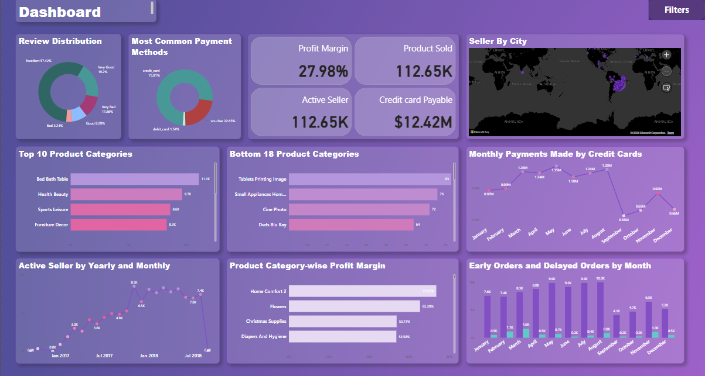

# 📊 Power BI Dashboard: E-Commerce Analytics

This project demonstrates my ability to analyze and visualize e-commerce data using Power BI. The dashboard provides insights into product performance, seller activity, payment methods, and customer reviews, along with advanced interactive features such as bookmarks, drillthrough buttons, and DAX measures.

## 🔍 **Project Overview**

The dashboard includes the following key visualizations and features:
- 📈 **Top 10 Product Categories**: Displays the highest-performing product categories by sales.
- 📉 **Bottom 18 Product Categories**: Shows the least-performing product categories.
- 🛍️ **Active Sellers Over the Year**: Visualizes the trend of active sellers over the year.
- 🏙️ **Active Sellers by City**: A breakdown of active sellers across different cities.
- 💳 **Most Common Payment Methods**: Highlights the payment methods most frequently used by customers.
- ⭐ **Review Distribution**: Shows the distribution of customer reviews across different products.

## 🖼️ **Dashboard Preview**

Below is a snapshot of the Power BI dashboard:

## 🔍 **Key Insights**

- **Top 10 Product Categories**: Displays the highest-performing product categories by sales.
- **Bottom 18 Product Categories**: Shows the least-performing product categories.
- **Active Sellers Over the Year**: Visualizes the trend of active sellers over the year.
- **Active Sellers by City**: A breakdown of active sellers across different cities.
- **Most Common Payment Methods**: Highlights the payment methods most frequently used by customers.
- **Review Distribution**: Shows the distribution of customer reviews across different products.

## 🔑 **Key Features**

- **Bookmarks**: Used for navigating between different views of the dashboard, allowing for a cleaner user interface and focused storytelling.
- **Drillthrough Buttons**: Provide detailed insights into specific product categories and seller activities by allowing users to explore individual items in more depth.
- **DAX Measures**: Custom DAX calculations are used to compute key metrics such as total sales, average ratings, and seller activity, ensuring accurate and dynamic reporting.

## 📂 **Project Files**
- `screenshot/`: Folder containing the dashboard screenshot.

